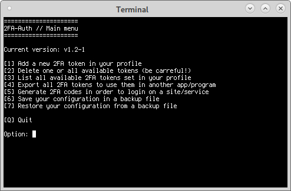

Quando se fala em autenticação, temos alguns meios de acessar um computador ou conta. Um deles é o tradicional método de credenciais (usuário e senha), além dos meios complementares de segurança, como a autenticação de dois fatores ("two-factor authentication" ou 2fa). Tal método gera tokens (códigos aleatórios de 6 dígitos) que permite ter uma segurança maior ao realizar um acesso em contas, serviços ou computadores. E esta postagem trata exatamente sobre este assunto: gerar tokens de autenticação de 2 fatores, porém usando seu terminal.

## Introdução

O projeto 2FA-Auth tem o seguinte objetivo: usar o terminal e facilitar a criação dos tokens/código de acesso para as contas que utilizem autenticação de dois fatores.

Bom, você deve esta se perguntando: "Qual a função do 2FA-Auth?" O 2FA-Auth surgiu como um método fácil e amigável de se utilizar o OATHTOOL (gerador de token), além de ter outras funções (como pode ser visto na tela do menu principal).

<!-- Informat -->
<ins class="adsbygoogle"
     style="display:block"
     data-ad-client="ca-pub-2838251107855362"
     data-ad-slot="2327980059"
     data-ad-format="auto"
     data-full-width-responsive="true"></ins>

    
## Pré-requisitos (dependências)

Para que você consiga utilizar o "2FA-Auth", primeiramente, instale os programas a seguir:


sudo apt install git gnupg2 oathtool # Distribuições baseadas no Debian
sudo dnf install git gnupg2 oathtool # Distibuições baseadas no RedHat.
sudo zypper in git gpg oath-tool # Distribuições baseadas em SUSE/openSUSE


## Download e utilização

Com o programa GIT, faça o clone (download) do projeto 2FA-Auth.


git clone https://github.com/alencc1986/2FA-Auth.git


Após a conclusão do download, rode o script:


cd /caminho/para/2FA-Auth/
./2FA-Auth.sh


Na primeira vez que você estiver executando o 2FA-Auth, o script verificará se o sistema está OK (2FA-Auth verifica se as dependências foram instaladas, inclusive se você tem chaves GnuPG em seu perfil).

Caso exista algum problema, uma mensagem de erro é exibida e o 2FA-Auth deixa de rodar. Porém, se estiver tudo certo, uma mensagem é exibida com uma lista de todas a chaves GnuPG disponíveis em seu perfil.

No caso de você possuir mais de 1 chave GnuPG, escolha uma de suas chaves e utilize as IDs (UserID e KeyID) para informar que chave dever ser utilizada na criptografia e decriptografia de informações referentes aos tokens.

Para maiores informações e aprendizado, leia os arquivos "README" e "doc/How\_to\_use\_2FA-Auth.pdf".
