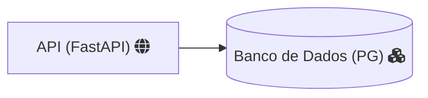

---

**Mermaid** permite criar diagramas e visualizações usando texto e código.

É uma ferramenta de diagramação e gráficos baseada em [JavaScript](https://terminalroot.com.br/tags#javascript) que renderiza definições de texto inspiradas em [Markdown](https://terminalroot.com.br/tags#markdown) para criar e modificar diagramas dinamicamente.

---

# Utilização
Para criar diagramas com Mermaid basta criar um arquivo de extensão `.md`(Markdown) e criar um bloco de código onde será inserida a sintaxe para seus diagramas, exemplo:

<pre>
```mermaid
```
</pre>
> Note que precisa definir a sintaxe para `mermaid`.

Exemplo básico, um fluxograma entre: A, B, C e D:

<pre>
```mermaid
graph TD;
    A-->B;
    A-->C;
    B-->D;
    C-->D;
```
</pre>

A saída será:

 


<!-- SQUARE - GAMES ROOT -->
<script async src="//pagead2.googlesyndication.com/pagead/js/adsbygoogle.js"></script>
<ins class="adsbygoogle"
style="display:inline-block;width:336px;height:280px"
data-ad-client="ca-pub-2838251107855362"
data-ad-slot="5351066970"></ins>
<script>
(adsbygoogle = window.adsbygoogle || []).push({});
</script>

---

# Suporte nativo para o GitHub
O GitHub possui suporte nativo para o GitHub. Isso significa que se você criar uma sintaxe Mermaid no seu [README.md](https://github.com/terroo/terroo) de algum repositório, será renderizado automaticamente, incluindo *controle* para manipular os diagramas, exemplo:

<pre>
# Recursos
- FastAPI
- Banco de Dados 



</pre>

Será renderizado como:

 
> Note os controles, se quiser ver renderizado [clique aqui](https://github.com/terroo/langs-test-loop).

---

Para mais informações e detalhes acesse: <https://mermaid.js.org/>


