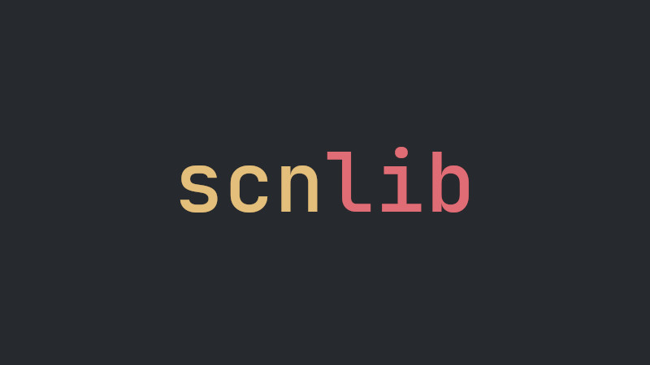

# Utilize esse scanf Moderno para C++
> É mais rápida que `iostream` e tipada, ao contrário de `scanf`.

 

---

`scnlib` é uma biblioteca C++ moderna para substituir `scanf` e `std::istream`. Esta biblioteca tenta nos aproximar ainda mais da substituição completa de `iostream`
e `stdio` em C.

É mais rápida que `iostream` e tipada, ao contrário de `scanf`. Pense em [{fmt}](https://terminalroot.com.br/2021/12/utilizando-a-fmtlib-para-saidas-formatadas-em-cpp.html) ou em `std::format` em C++20, mas
na outra direção.

Esta biblioteca é a implementação de referência da proposta de padrões ISO C++ [P1729 "Análise de Texto"](https://wg21.link/p1729).

---

## Instalação
Para compilar basta clonar com [git](https://terminalroot.com.br/tags#git) e usar o [CMake](https://terminalroot.com.br/tags#cmake) e instalar:

```bash
git clone https://github.com/eliaskosunen/scnlib
cd scnlib
cmake -B build .
cmake --build build
sudo cmake --install build
```
> Após isso, já pode sair do repositório e removê-lo: `cd .. && rm -rf scnlib`.

---

## Exemplo básico
Nesse exemplo, além da `scnlib` também há o uso o [`println` do C++23](https://terminalroot.com.br/2025/04/como-instalar-o-gcc-14-e-usar-o-cpp23.html), vamos ler 2 números via prompt e automaticamente será exibida a soma deles:

> `main.cpp`

```cpp
#include <scn/scan.h>
#include <print> 

constexpr auto sum = [](int x, int y){
  return x + y;
};

int main(){
  if(auto result =
      scn::prompt<int, int>("Informe 2 números para somar? ", "{} {}")) {
    auto [a, b] = result->values();
    std::println("A soma de {} mais {} é: {}", a, b, sum(a, b));
  }else{
    std::println(stderr, "Error: {}", result.error().msg());
  }
}
```

Para compilar use a *flag*: `-lscn`:
```bash
g++ main.cpp -lscn
```

E então, rode o binário e teste, exemplo:
```bash
./a.out
Informe 2 números para somar? 3 6
A soma de 3 mais 6 é: 9
```

---

Para mais informações acesse [o repositório oficial](https://github.com/eliaskosunen/scnlib) e o endereço: <https://scnlib.dev/>.


